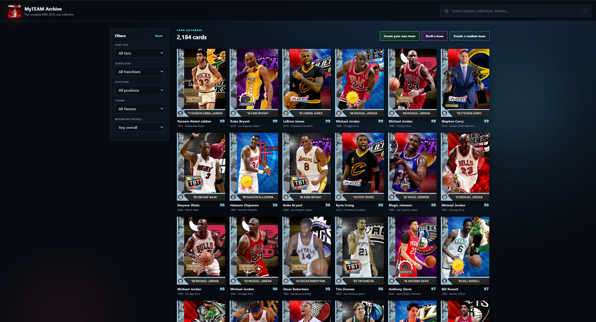
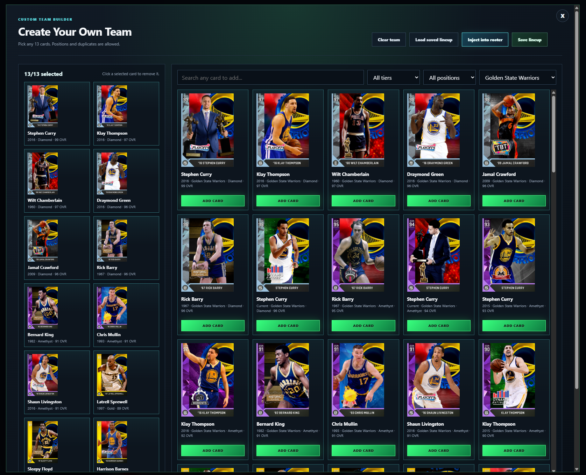
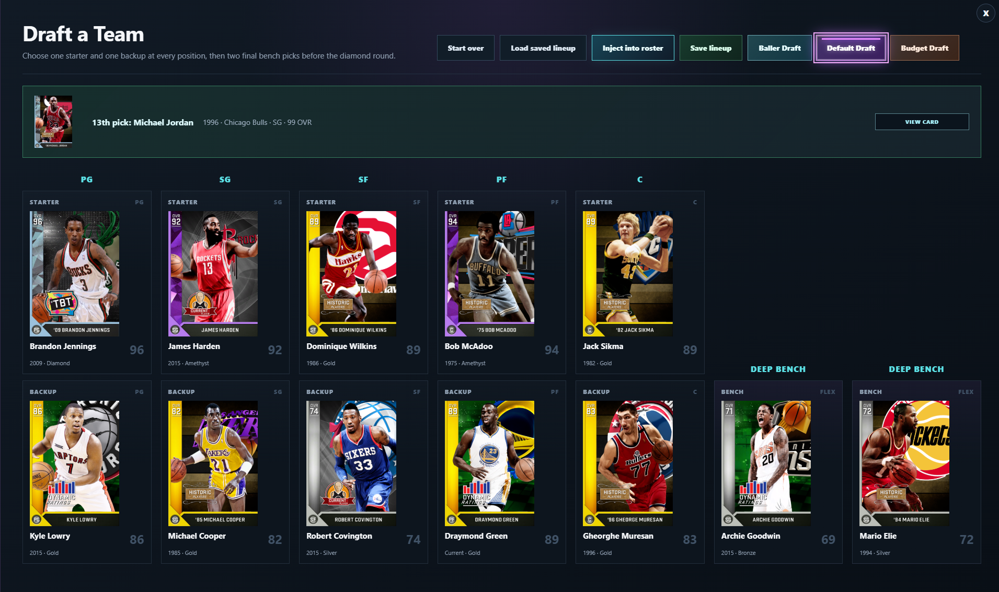
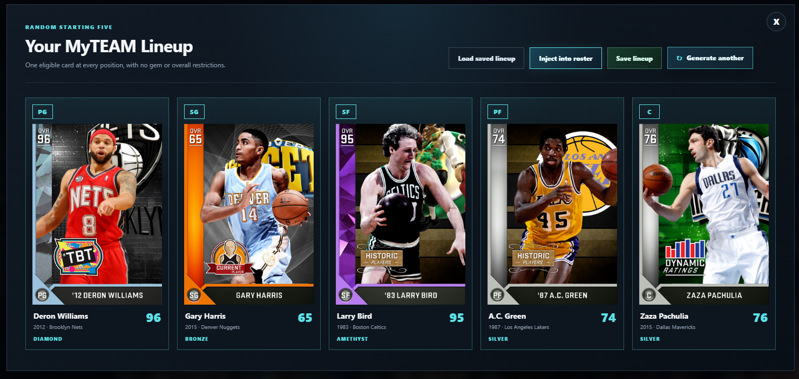
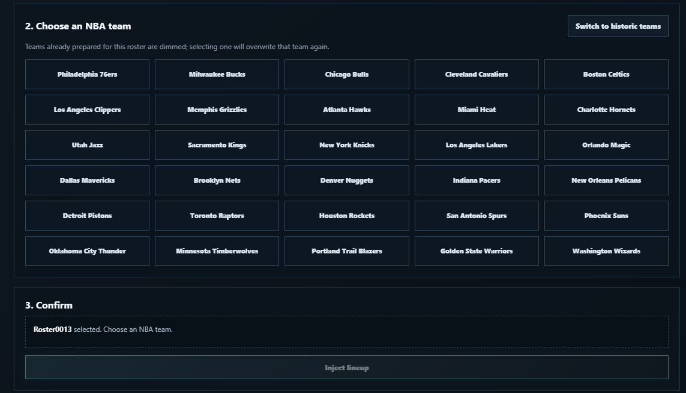
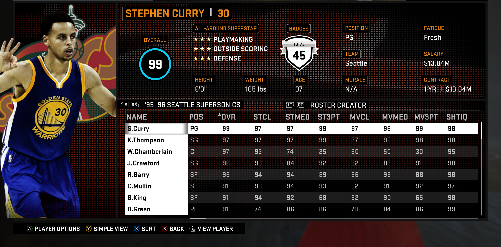

# NBA 2K16 MyTEAM Viewer

An unofficial, non-commercial companion app for browsing archived NBA 2K16 MyTEAM cards and injecting selected cards into a roster loaded in a local copy of NBA 2K16.

## Screenshots

Click any screenshot to view it at full size.

<table>
  <tr>
    <td width="50%" align="center"><a href="docs/screenshots/home-page.png"></a><br><sub>Browse the card archive</sub></td>
    <td width="50%" align="center"><a href="docs/screenshots/create-a-team.png"></a><br><sub>Create a custom team</sub></td>
  </tr>
  <tr>
    <td width="50%" align="center"><a href="docs/screenshots/draft-screen.png"></a><br><sub>Draft a lineup</sub></td>
    <td width="50%" align="center"><a href="docs/screenshots/random-team.png"></a><br><sub>Generate a random team</sub></td>
  </tr>
  <tr>
    <td width="50%" align="center"><a href="docs/screenshots/injection-screen.png"></a><br><sub>Choose a roster and team</sub></td>
    <td width="50%" align="center"><a href="docs/screenshots/in-game-result.png"></a><br><sub>See the result in NBA 2K16</sub></td>
  </tr>
</table>

## Requirements

- A legally obtained Windows copy of NBA 2K16.
- Windows 10 or newer.
- NBA 2K16 must be running with the intended roster loaded before using roster injection.
- Must use a Patch 0 or Patch 10 version of the game.
- This project does not include, install, replace, or download NBA 2K16 executables, DLLs, archive containers, or other core game files. The release ZIP includes one custom compatibility roster specifically for the college-team injection feature.

## Using the App

1. Download the application package [here](https://github.com/jpallen2828/nba-2k16-myteam-viewer/releases) and extract the ZIP to local storage.
2. Start NBA 2K16 and load the roster you want to edit.
3. Start `NBA 2K16 MyTEAM Viewer.exe`.
4. Browse, draft, or create a lineup in the viewer.
5. Open the roster injector, choose the correct roster file, and select the team to overwrite.
6. If the app cannot automatically verify the loaded roster, only use the manual confirmation button when that exact roster is already open in NBA 2K16.
7. On the first injection for a newly detected NBA 2K16 executable build, the viewer may take a short moment to create a local compatibility profile. Later injections with that same build use the saved profile and should be much faster.
8. In NBA 2K16, rebuild the rotations for the team you overwrote, then save the roster. This is recommended for the best in-game experience.

### Importing Card Studio custom cards

NBA 2K16 Card Studio 0.8.1 and newer can export a `.2k16custom` package containing both the rendered card PNG and its complete authored player data. In the Viewer, choose **Import custom card** and select that package. Imported cards appear in the normal database, filters, drafts, custom-team builder, and roster injector. The **Custom cards** switch hides or restores the whole imported collection without deleting it.

Custom packages preserve name, season, tier, franchise, positions, height, wingspan, weight, jersey number, handedness, Face ID, Portrait ID, loyalty, injury slots, Force Non-Starter, Play Initiator, play types, all mapped attributes and tendencies, badges, hot zones, all 45 grouped signature selectors, and player-gear IDs. Imported packages are stored in the current Windows user’s local application-data directory so they remain available after updating or replacing the portable Viewer folder.

College-team injection is available only for the compatible expanded hidden-team roster. The app does not unlock college teams. It verifies the loaded roster's stable TEAMDATA layout before every college write, and prior app injections do not invalidate that check.

### Installing the College-Team Compatibility Roster

The release ZIP includes a file named `Myteam Compatibility roster`. To make it available in NBA 2K16:

1. Open NBA 2K16 and create a new roster.
2. Close NBA 2K16.
3. Find your NBA 2K16 roster directory. It is usually inside a path ending in `OfflineStorage\User\remote`.
4. Delete the newest roster file you just created. Make sure you identify the correct new file before deleting it.
5. Copy `Myteam Compatibility roster` from the application download into that directory.
6. Rename the copied compatibility roster to exactly the filename you deleted, including capitalization and number—for example, `Roster0014`.
7. Start NBA 2K16 and load that roster.
8. Keep the compatibility roster open while using a college team as the injection destination.

College injection automatically checks the live roster's team layout before writing. The check continues to work after earlier injections made by the application, so the same compatibility roster can be injected multiple times.

If the app cannot detect the installation or roster folder, run `Diagnose NBA 2K16 Install.exe` and include the generated compatibility report when asking for support.

Because this is an unsigned fan-made tool, Windows Defender or SmartScreen may warn about it or block it even when downloaded from the official project release. Users who trust the release and have reviewed the source code may need to allow or whitelist `NBA 2K16 MyTEAM Viewer.exe` in Windows Security for the app to run normally.

## Acknowledgments

Special thanks to my friend Ray for helping to fix some of the tendencies, gear, hot zones, and more of many of these players. This project would not be as good without him.

## Build from source

The prebuilt ZIP is the recommended option for most users. To build the application yourself, use Windows with Python 3.13 or newer and run these commands from the repository's top-level folder:

```powershell
py -3.13 -m pip install -r requirements.txt
py -3.13 source\build_public_release.py
```

The source repository may exclude large generated caches or release-only assets. Build outputs are created under `build/`, `dist/`, and `release/`.

## Disclaimer

This is an independent fan project. It is not affiliated with, endorsed by, or sponsored by 2K, Take-Two, the NBA, the NBPA, or any rights holder. See [GAME_FILES_NOT_INCLUDED.md](GAME_FILES_NOT_INCLUDED.md) and [THIRD_PARTY_AND_RIGHTS.md](THIRD_PARTY_AND_RIGHTS.md) for more detail.
